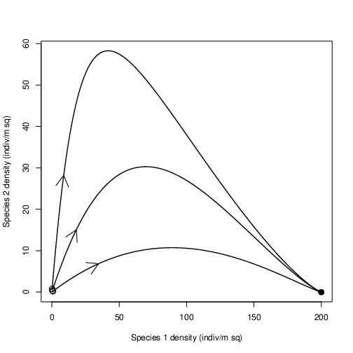
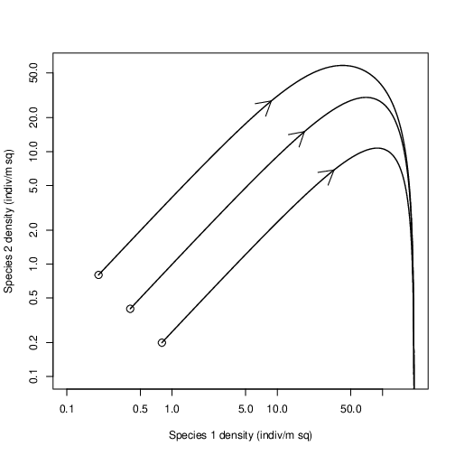
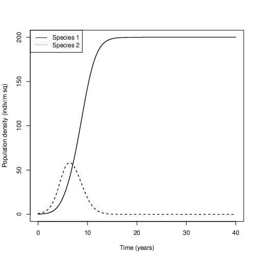
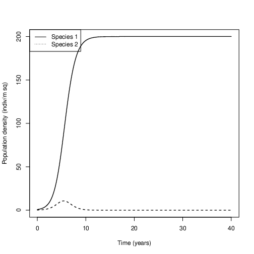

To load compPlots, type

``` R
source ("https://raw.githubusercontent.com/Bio3SS/Competition_models/master/comp.R")
```

You can also [open the file directly](https://raw.githubusercontent.com/Bio3SS/Competition_models/master/comp.R). It's a good idea to open it directly if you want to work on this project somewhere without an internet connection.

### A new library

`compPlots` uses a library called deSolve, which may not be installed
with your version of R. If you are not sure, type:

``` RR
install.packages("deSolve")
```

You only have to do this once per installation of R. You may have
already done this in an earlier assignment.

Sample plots
------------

See [our plot hints page](../plotHints)

If we say, for example:

``` R
library(deSolve)
compPlots(x1=c(0.2, 0.4, 0.8), x2=c(0.8, 0.4, 0.2)
	, K1=200, alp12=1, alp21=1
)
``` 

### Phase plots



#### Log scale

The same data as the plot above; only the scale is different.


### Time plots

One time plot for each orbit on the phase plots:






### Don't worry

Depending on how R is set up, it will probably show a blank plot window
first when you run `compPlots`. Just hit enter to see the first plot,
and so on.

Basic idea
----------

`compPlots` simulates a simple system with two competing species. You
should be able to document dominance, coexistence and mutual exclusion.
If you give lists for x1 and x2 (see strange format above), it puts all
of the simulations onto the same phase plot, but makes a different time
plot for each simulation.

Note that `compPlots` simulates for only as long as you tell it to using
MaxTime; if you suspect it hasn't reached the end, MaxTime can be
increased (you should first look at the default value below for
reference).

Arguments
---------

To see the arguments for compPlots, type
``` R
args(compPlots)
```


### What the arguments do

(units in parens)

#### Parameters

-   `r1,` `r2`: rmax for each species (1/t)
-   `K1,` `K2`: equilibrium value for each species when alone
    (indiv1, indiv2)
-   `alp12,` `alp21`: cross-species competitive effects (1)

#### Simulation

-   `x1,` `x2`: starting point(s) for simulations.
    (indiv1, indiv2)
-   `MaxTime`: How long to simulate (t)
-   `steps`: Number of points to plot in simulation (1)
