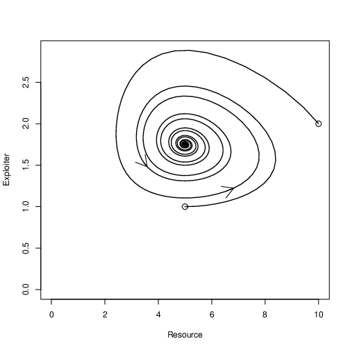
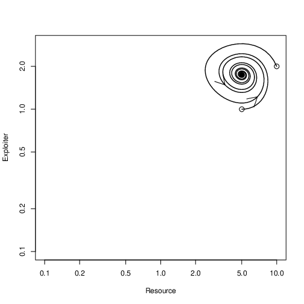
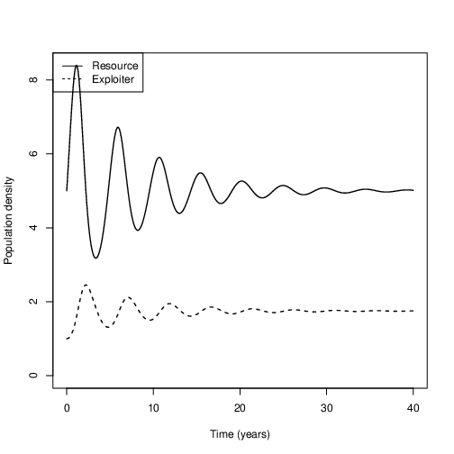
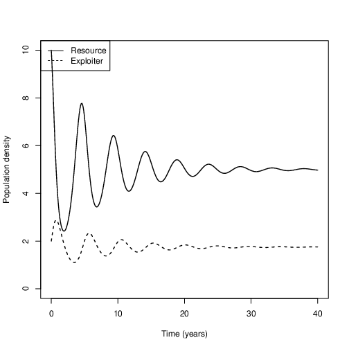

To load explPlots, type

``` R
source ("https://github.com/Bio3SS/Exploitation_models/raw/master/exploitation.R")
```

You can also [open the file directly](https://github.com/Bio3SS/Exploitation_models/raw/master/exploitation.R)
It's a good idea to open it directly if you want to work on this project somewhere without an internet connection.

### A new library

`explPlots` uses a library called deSolve, which may not be installed
with your version of R. If you are not sure, type:

``` RR
install.packages("deSolve")
```

You only have to do this once per installation of R. You may have
already done this in an earlier assignment.

Sample plots
------------

If we say, for example:

``` R
library(deSolve)
explPlots(Nf=c(5, 10), Ne=c(1, 2), rf=2)
``` 

### Phase plots



#### Log scale

The same data as the plot above; only the scale is different.


### Time plots

One time plot for each orbit on the phase plots:





One possibly confusing part is how the lists work. It goes through values of Ne and Nf one at a time, so in this case, it will start first at (5, 1) and then at (10, 2).

### Don't worry

Depending on how R is set up, it may show a blank plot window
first when you run `explPlots`. Just hit enter to see the first plot,
and so on.

Basic idea
----------

`explPlots` simulates a simple system with two competing species. You
should be able to document dominance, coexistence and mutual exclusion.
If you give lists for x1 and x2 (see strange format above), it puts all
of the simulations onto the same phase plot, but makes a different time
plot for each simulation.

Note that `explPlots` simulates for only as long as you tell it to using
MaxTime; if you suspect it hasn't reached the end, MaxTime can be
increased (you should first look at the default value below for
reference).

Arguments
---------

To see the arguments for explPlots, type
``` R
args(explPlots)
```

### What the arguments do

(units in parens)

#### Parameters

* `satF`: Characteristic value for exploiter satiation (resource density). If resource density is high compared to this number, then exploiter satiation is important. If set to NULL, there is no exploiter satiation.
* `Ke`; `Kf`: equilibrium value for each species when alone (exploiter density; resource density). If set to NULL then there is no density dependence for that species.
* `rf`; `de`: Characteristic growth rate of resource; decline rate of exploiter (1/time)
* `Ce`; `Cf`: Density of exploiter; resource that would balance the growth of the resource; exploiter in the absence of density dependence or satiation (exploiter density; resource density)

#### Simulation

* `Nf`; `Ne`: starting point(s) for simulations.
* `MaxTime`: How long to simulate (time)
* `steps`: Number of points to plot in simulation (1)

#### Harvest
* `fHarv`; `eHarv`: per capita rate of harvesting for each species (1/time)
* `harvTime`: Amount of time to simulate before harvesting starts (time)
