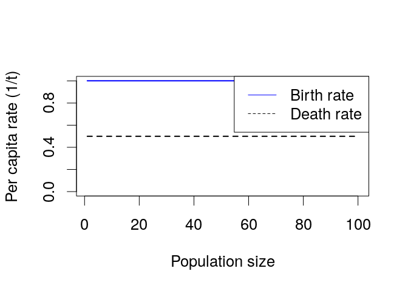
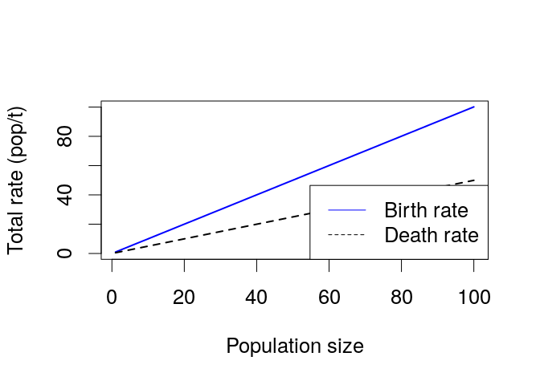

Intro
=====

Intro
=====

See also [Introduction to R page](r.export.html).

A new library
=============

The time plots in bd use a “library” called deSolve, which may not be
installed with your version of R. If you are not sure, type:

    install.packages("deSolve") 

**You only have to do this once per installation of R.** If you want,
you can skip this step and come back if you get an error saying you do
not have deSolve.

Loading
=======

To load `bd`, type:

    source("https://raw.githubusercontent.com/Bio3SS/Birth_death_models/master/bd.R") 

This should work if you are connected to the internet. `source` is a
function; it tells R to load some information. The thing inside the
parentheses is an argument; it tells R what information to load.

You can also open [the
file](https://raw.githubusercontent.com/Bio3SS/Birth_death_models/master/bd.R)
directly. It’s a good idea to open it directly if you want to work on
this project somewhere without an internet connection.

Sample plots
============

If we say, for example:

    bd()

Don’t worry
-----------

Depending on how R is set up, it will probably show a blank plot window
first when you run `bd`. Just hit enter to see the first plot, and so
on.

Basic idea
==========

We construct a birth rate and a death rate using a starting value (which
is a rate, with units 1/time) and characteristic values for density
dependence (
*D**b*
and
*D**d*
, for birth and death rates) and for Allee effects (
*A**b*
and
*A**d*
). The characteristic values have units of population size. The idea is
roughly that density dependence is strong when the population is larger
than the characteristic value for density dependence, and Allee effects
are strong when the population is smaller than the characteristic value
for Allee effects.

The equation for per-capita birth rate is
*b*(*N*) = *b*0exp ( − *N*/*D**b*)exp ( − *A**b*/*N*)
. The negative signs are because when things get worse the birth rate
gets lower. If either
*D**b*
or
*A**b*
is set to NULL in R (the default), that term is ignored.

The equation for per-capita death rate is exactly similar, but without
the negative signs: when things get worse, the death rate gets higher:
*d*(*N*) = *d*0exp (*N*/*D**d*)exp (*A**d*/*N*)
.

By default, `bd()` makes a per-capita growth plot and a total growth
plot. If you give it a starting population, it also simulates and makes
a time plot (see above).

The key thing to get is that the characteristic values have the same
units as the population. When Allee effect parameters get bigger, or
density-dependence parameters get smaller, that means that these effects
kick in sooner, with stronger effects.

Arguments
=========

To see the arguments for bd, type:

    args(bd) 

    ## function (N0 = NULL, MaxTime = 20, steps = 100, popMax = 100, 
    ##     b0 = 1, bDD = NULL, bAllee = NULL, d0 = 0.5, dDD = NULL, 
    ##     dAllee = NULL, reportPcTotal = "b", popSteps = 100, fontSize = 1, 
    ##     legendSize = 1, title = "", tlab = "Time (years)", plab = "Population size", 
    ##     elines = FALSE, arrows = TRUE) 
    ## NULL

(units in parens)

Parameters
----------

-   `b0`: Per capita birth rate before Allee or DD effects (1/t)
-   `bDD` –
    *D**b*
    : Scale for density-dependent effects on birth rate (indiv)
-   `bAllee` –
    *A**b*
    : Scale for Allee effects on birth rate (indiv)
-   `d0`: Per capita death rate before Allee or DD effects (1/t)
-   `dDD` –
    *D**d*
    : Scale for density-dependent effects on death rate (indiv)
-   `dAllee` –
    *A**d*
    : Scale for Allee effects on death rate (indiv)

Simulation
----------

-   `N0`: sets the value of
    *N*0
    for simulations (indiv).
-   `MaxTime`: How long to simulate (t)
-   `steps`: Number of points to plot in simulation (1)

Rates
-----

-   `popMax`: Maximum population to plot for rates (indiv)
-   `reportPcTotal`: Report growth rates as **p**er capita, **t**otal
    **b**oth or **n**either.

Appearance
----------

-   `legendSize` controls the size of the legend. The default is 1, so
    use e.g., 0.5 to make the legend half as big.
-   `fontSize` controls the size of the labels and numbers along the
    axes. It works like `legendSize`.
-   `title="My title"` can be used to add a title to your graph.
-   `plab="Density of dolphins"` can be used to add to relabel the x
    axis of response graphs
-   `tlab="time (months)"` can be used to add to relabel the x axis of
    time plots
