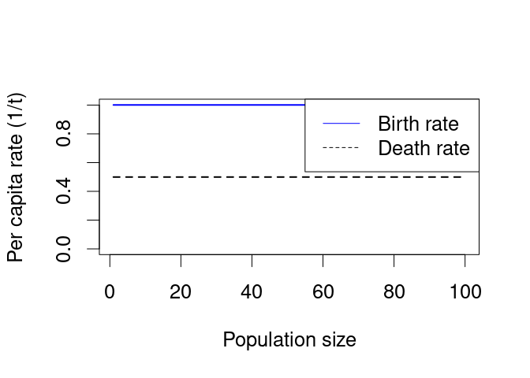
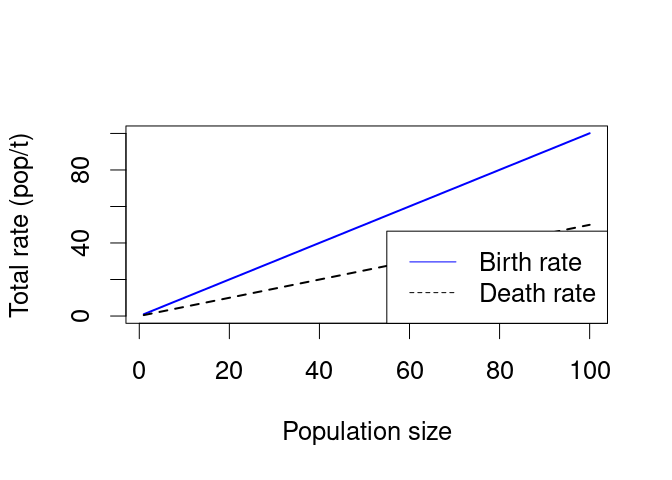
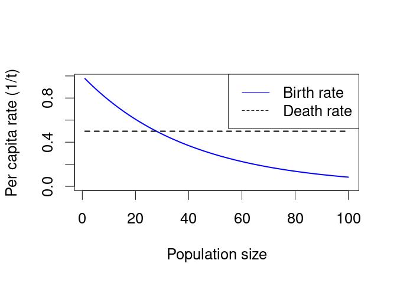
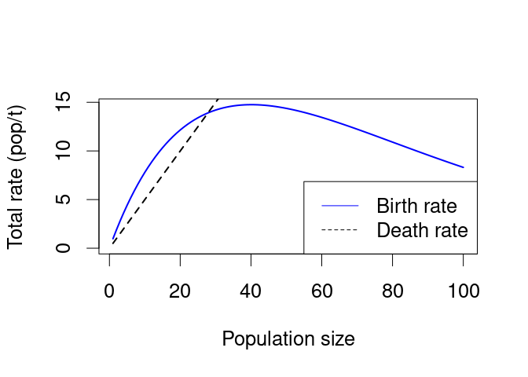

Installing
----------

You should gain access to a laptop and bring it to your tutorial. If
this will be a problem for you, please communicate with Dushoff.

Install and run the program R from
<a href="http://cran.r-project.org/bin/windows/base/" class="uri">http://cran.r-project.org/bin/windows/base/</a>
(windows) or
<a href="http://cran.r-project.org/bin/macosx/" class="uri">http://cran.r-project.org/bin/macosx/</a>
(mac). *You should try this step before your tutorial*. In each case you
want to download and then run the first file on the page.

You should also install RStudio
(<a href="http://www.rstudio.com/ide/" class="uri">http://www.rstudio.com/ide/</a>).
It’s possible to do everything in plain R, but RStudio will enhance your
experience, and it will be the way the TAs teach things.

Command line
------------

R gives you a command line where you can type commands. For example,
type

`2+2`

followed by <enter> to see what R thinks the sum is.

Type `q()` to quit. The parentheses are weird, they let R know that q is
a *function* it is supposed to try to execute, in this case by quitting.
After you type `q()` R will ask you some sort of confusing question:
answer either yes or no, it probably shouldn’t matter.

If R ever gets confused, you should be able to get it to give you an
error and go back to normal by typing `;` and then <enter> . If that
doesn’t work, try `";` (it’s hard to make a single quote in Rstudio,
though). If that doesn’t work, kill the window by force and start over.

Library
-------

The time plots in bd use something called deSolve, which may not be
installed with your version of R. You can install it by typing:

    install.packages("deSolve") 

or by clicking on “packages” at the menu on top of the **lower right**
Rstudio window.

**You only have to do this once per installation of R.**

The function
------------

To load `bd`, type:

    source("https://raw.githubusercontent.com/Bio3SS/Birth_death_models/master/bd.R") 

This should work if you are connected to the internet. `source` is a
function; it tells R to load some information. The thing inside the
parentheses is an argument; it tells R what information to load.

You can also open [the
file](https://raw.githubusercontent.com/Bio3SS/Birth_death_models/master/bd.R)
directly, or right-click to save it to your computer.

Running
-------

Now you have loaded a function. Let’s try running it.

Type:

    bd() 

That’s basically what you need from the introduction.

Exploring further
-----------------

We can learn more about `bd` by using the function `args`; this tells
you what arguments the function takes:

    args(bd) 

    ## function (N0 = NULL, MaxTime = 20, steps = 100, popMax = 100, 
    ##     b0 = 1, bDD = NULL, bAllee = NULL, d0 = 0.5, dDD = NULL, 
    ##     dAllee = NULL, reportPcTotal = "b", popSteps = 100, fontSize = 1, 
    ##     legendSize = 1, title = "", tlab = "Time (years)", plab = "Population size", 
    ##     elines = FALSE, arrows = TRUE) 
    ## NULL

Everything in the parentheses is an argument that tells the function
what to do. You should be able to change it to make the function do
something else. For example, try typing

    bd(bDD=40) 

-   For more information on `bd`, see
    [BirthDeath](BirthDeath "wikilink")
-   Trouble? See [R troubleshooting](R_troubleshooting "wikilink")
